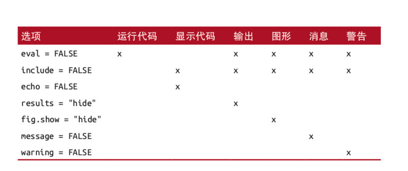

# R_Onlinebook/Dashboard

## Automation/Integration of DCEs design, survey and analysis

For typical DCEs, we usually undertake the experimental design using Ngene, then hire a company such as SurveyEgine to program the survey and collect data, and finally analyse data using Stata or R. This process has several disadvantages as below:

1. disintegrated workflow, and thus needs coordinators at different stages;
1. generating lots of documents and files in different forms, e.g. words, excel, html files, coding files;
1. difficult to debug when unexpected results arise;
1. substantial costs by using external services from, e.g., Ngene and SurveyEgine.

To resolve these issues, I propose an automated and integrated solution using free and open source as listed below:

1. Step I, the project is built and synchronised between GitHub website and R local machine, and all files are using Rmarkdown language for both writing and coding;
1. Step II, we design a simple DCE (for pilot purposes) with orthogonal main-effect arrays using "support.CEs" package in R, or we design a DCEs with Bayesian adaptive designs for the mixed logit model using **idefix** package in R (**DCEtool**包装了idefix);
1. Step III, after generating choice sets and questionnaire, we create interactive dashboard html files using "idefix" and shiny application in R;
1. Step IV, all files are sychronised and deployed by the GitHub, then we obtained the website link for survey and data collection (using our own database or pay a data panel provider to do it);
1. Step V, we analyse choice data and do estimation by using either packages in R directly, or Stata coding (both inline and from a .do file) from R.

我继续找到3个资源, 1和2重名但无overlap

1. Kaufman has a [Plos ONE](https://journals.plos.org/plosone/article?id=10.1371/journal.pone.0232424) and [GitHub](https://github.com/aaronrkaufman/shinySurveys) with focus on DCE ShinySurveys
    - 文章里实现4个功能,如DCE问题随机化, 但在RStudio Cloud和RStudio都页面闪退, 因此以后网调稳定还是很重要
1. Jonathan Trattner has a formal R package [shinysurveys](https://shinysurveys.jdtrat.com/) aims create and deploy surveys in 'Shiny'
1. John Paul Helveston used formr.org to create a specific [formr4conjoint](https://github.com/ctang83/formr4conjoint)  
    - formr利用OpenCPU和Google form, 可能更稳定
	- 给formr邮件申请admin账户启动survey功能, 没有回复
	- 如果formr无法用, 就直接用Google Forms吧
1. Google form可以实现DCE的[问题随机化](https://support.google.com/a/users/answer/9308764?hl=en), 也可以survey

** TODO:** 
1. randomization in displaying of attributes for each choice task
	- 这点在questionnaire上面手动修改就能达到
1. randomization of respondents across blocks, e.g. A-B-testing or experiments


### Publish

RStudio directly link to two ways: RStudio Connect and Shinyapps.io
	- Shinyapps网站点击右上角用户名->token->copy后到RStudio publish粘贴, 本地和Shinyapps自动connect, 完成deploy
	- Shinyapps有9-299$ plans, 应该可以提高稳定和响应
	- [comparison](https://www.rstudio.com/pricing/comparison/), 直接用RStudio Connect(价格上千)

Cloud Deployment for apps不难, 查了一下MQ大学没有云,但MQ网页推荐了[AUS Research Data Commons](https://ardc.edu.au/services/nectar-research-cloud/)

### Shiny

Shiny app主要包括两个关键组件：1) UI(user interface)前端外观; 2) server：app后台运行

- simplest app.R file, or ui/server functions divided into two files
```r
library(shiny)     #加载shiny包

ui <- fluidPage(   #定义ui，这里是一个界面显示Hello, World!
  "Hello, world!"
) 
                   #定义app如何运行，这里是空的，不做任何事情
server <- function(input, output, session) {
} 

shinyApp(ui, server) #创建并启动app
```

- 维护是一种负担，在shiny中尽量使用响应表达式(reactive expression)来精简代码, reactive expression用reactive({})封装代码并赋值给一个变量，它只在启动app的时候运行并将结果缓存


## Online data collection/transfer  

Ideally, or the perfect situation, is that we collect and summarise data from internet, clean data, analyse data, and present outcomes online. 

- Data infrastructure of Australia  
[library(aurin)](https://aurin.org.au/resources/aurin-apis/) is "Australia's single largest resource for accessing clean, integrated, spatially enabled and research-ready data on issues surrounding health and wellbeing, socio-economic metrics, transportation, and land-use.". This package provides functions to download and search datasets from the AURIN API (it's free to use!).

There is an example in aurin website showing access data, obtain data through this API. 

- R包 rvest: Easily Harvest (Scrape) Web Pages [参考手册](http://cran.r-project.org/web/packages/rvest/index.html)  
数据抓取两大阶段：网页获取和网页解析  
     R主要靠两个包，网页获取是RCurl，解析是靠XML  
python也对应两个包，网磁获取是requests，解析是BeautifulSoup

- R包 Rfacebook: 提取facebook的数据

- XML(eXtensible Markup Language)可扩展标记语言, 是一种结构化数据交换语言, 可描述非常复杂的数据结构, 常用于传输和存储数据

- YAML(.yml files, Yet Another Markup Language) is the metadata that tells R Markdown, pandoc, and other software exactly how to process or display the document

- What is the difference between YAML and JSON? YAML is a superset(超集.VS subset) of JSON

## Building online book(Bookdown)

This tutorial will show us easiest way to build an online book (or a book-style website) through RStudio and GitHub (may also by bookdown.org). We'll call this book "BB".

**1) Start on local computer**

1. Copy folder "D:\R\bookdown_template"(this version is from Jules32, much easier than Yihui's bookdown-demo) to a reasonable place
1. Rename 2 things from "bookdown_template" to "BB":
    - the folder itself
    - the .Rproj file
1. Double-click the .Rproj file to launch RStudio 
1. Click on the Build tab in the top right pane to build book
    
**2) Create "BB" GitHub repo**

1. Go to your GitHub account: github.com/username
1. Click on Repositories, and the green button "New" to create a new repo
1. Name this new repo "BB" (DO NOT initialize this repo with a README)
1. Click the green "create repository" button, then copy URL

**3) Turn "bookdown_template" into "BB"**

1. Go back to RStudio, see your "BB" project
1. In the Console, type `usethis::use_git()` and say Yes to the two prompts. This will restart R and give you a new Git tab in the upper right pane.
1. Now, click on the Terminal tab next to the Console tab. 
1. Type `git remote add origin URL`
1. Type `git push --set-upstream origin master` (this sentence upload files)

**4) Publish "BB" (Last step)**

1. Refresh github, then files should be there! 
1. Click Settings
1. Scroll down to GitHub Pages, click "Check it out here"
1. Change the Source pulldown from "None" to "master branch /docs folder"
1. It should say "Your site is ready to be published at https://username.github.io/BB/"

**5) Sync/Update online book in Github**

1. Rstudio to build(knitr) the whole book, including all .Rmd files
    - In Build panel, click "Build Book"
    - or in Console, type `rmarkdown::render_site(encoding = 'UTF-8')`
1. In Git panel, select all files, click Commit, appears a new window
1. Input "XX changes", click Commit
    - Click the staged checkbox for the modified files you want to commit to GitHub repository
1. Finally, click Push -> Done!

PS1: we ignore Travis and related continuous integration(持续部署) here, actually now Yihui uses Makefile and _render.R [instead](https://github.com/rstudio/bookdown/tree/main/inst/examples). 

PS2: Sync btw local RStudio and RStudio Cloud using Git: 
    - because there are three copies saved in local/RStudioCloud/GitHub, if we used RStudio Cloud and sync it with GitHub, then we first need to pull/merge at local PC (commit 1), and push local changes to GitHub (commit 2). 

**6) Writing and adding chapters(.Rmd) and citations**

1. Build a new .Rmd file, name it and begin writing. As Index.Rmd is always the first chapter, we start ordering from "02-xx".
1. For citations, 

The appearance for coding chunks are different btw two types below (the second is more obvious):

%```
%xx
%```

%```r
%xx
%```


## Building single page(robobook)

In above chapter *Building online book(Bookdown)*, multiple *.Rmd and .md files, along with a “site YAML file”(vs. YAML header), as input, a multipage website or book with internal navigation as output. (This is how the course web pages are constructed.)

If we don't need a book structure, but a single page with a structured-table(especially good for a report). 
We use 1) YAML header and 2) first code chunk in a single .Rmd, with outputing a single HTML. 
The template robobook is great for reading. 
```
---
title: "啊啊啊"
date: "`r Sys.Date()`"
  #这个output部分在multiple .Rmd files中就是_output.yml文件
  #所以 bookdown::gitbook: 对等 rmdformats::robobook:
output:   
  rmdformats::robobook:
    code_folding: show
    self_contained: true
    default_style: "light"
    downcute_theme: "default"
---
#```{r setup, include=FALSE}
#First code chunk setting global options
#knitr::opts_chunk$set(cache = TRUE)
#```
```

PS: Rmd has many excellent templates: rticles(journal papers), prettydoc(html), rmdformats(online book, e.g. robobook style), tufte

**How to insert figures?**

For my notebook, all figures are saved in folder /NB_tang/figs. Using codes below: 

`{width=100%}`

{width=100%}


## Building Dashboard(Flexboard)

**some definitions**

1. Rmarkdown aims to develop your code and ideas in a reproducible document
1. Shiny package aims building interactive web applications
    - `File` -> `New File` -> `Shiny` uses .R file
1. Flexdashboard package aims building interactive dashboards using Rmarkdown 
    - flexdashboard像Bookdown和single page的结合, 适合展示一个topic的数据
    - flexdashboard是single .Rmd(用===分panel, 用---分column, 用###分box区域)
    - .Rmd内结构也是YAML header + first code chunk
    - flexdashboard用_site.yml as a simple site generator(基于rmarkdown, 后来发明了**blogdown**使用third-party site generator like Hugo)
    
This tutorial shows us how to build an online dashboard, using flexdashboard, with RStudio and GitHub. We call this project "BB".

**1) Start on local computer**

1. Copy folder "D:\R\flexdashboard_template" to a reasonable place
1. Rename 2 things from "flexdashboard_template" to "BB":
    - the folder itself
    - the .Rproj file
    - the _site.yml -> name(website)
1. Double-click the .Rproj file to launch RStudio 
1. Click on `Knit` to build website .html
    
**2) Create "BB" GitHub repo**(see **Building online book**)

**3) Turn "bookdown_template" into "BB"**(see **Building online book**)

**4) Publish "BB" (Last step)**

## Building website wt multi-pages(Blogdown)

**Blogdown** use the third-party site generator, Hugo. 

**1) Start on local computer**

1. Copy folder "D:\R\blog" to a reasonable place

