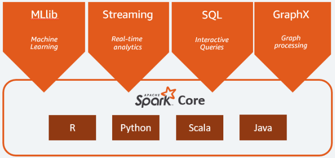

# R

- R资源汇总
1. An updating online-book [R for Data Science](https://r4ds.had.co.nz/index.html), 搜关键词
1. [Databases using R](https://db.rstudio.com/)
1. RStudio [精选包](https://www.rstudio.com/products/rpackages/): 
		- **Analyse & Explore**: tidyverse(dplyr数据框 tidyr等价Stata), ggplot2, purrr函数, stringr字符
		- **Model & Predict**: TensorFlow, tidymodels, Sparklyr 
		- **Communicate & Interact**: shiny, Rmarkdown, flexdashboard
		- **Connect & Integrate**: Sparklyr(interface to Apache Spark), Plumber(create API), reticulate(interface to Python)

PS: Apache Spark is an open-source unified analytics engine for large-scale data processing
{width=60%}


## Workflow/Reproducible research 

- Why do we need notebook interface(笔记本界面)? A:human–computer interaction人-机交互可以理解为人-信息交互, 如下有多种方式, 但最好的中间载体是一个笔记本界面notebook interface(文学编程literate programming), which input 文本、代码、公式、图片、数据、PDF, while output HTML, PDF, DOC, dashboard and so on. Some major human-computer interfaces as below:  
1 Text-based user interface, e.g. Command-line interface -> notebook interface  
2 Graphical user interfaces (GUIs)  VS. Sonic user interface  
3 Natural language user interface  
4 Tangible user interface, e.g. Touch user interface  

- Rmd网上有很多模板可用包安装, 如["stevetemplates"](https://github.com/svmiller/svm-r-markdown-templates), File-> New File-> R Markdown->From templates增加了很多新模板  
R Markdown(脚本文本)比Latex好得多，生成PDF, word, html, slides  
R Shiny   (脚本文本交互), 都可以通过github下载各种templates  

- 名词比较混  
Markdown   (markup language): a “lightweight” markup language (like HTML)  
Markdown   (R package): the predecessor of rmarkdown, converts .Rmd files into HTML  
R Markdown (R package): 包括两个小包 rmarkdown and knitr  
R Markdown (markup language): .Rmd file that is an excellent “literate programming” and “reproducible research”

- **Knitr** converts  
.Rmd   -> .md  
.Rnw(Sweave) -> .tex    
.Rhtml   -> .html  
After Knitr works, then **Pandoc** converts md/tex/html into various formats as PDF/HTML/Word/.

- 数字下面插入小点, 空两个tab键
```r
1. Rename 2 things from "bookdown_template" to "BB":
    - the folder itself
    - the .Rproj file
```

## Plot/graph/visualisation

- install.packages("geofacet")  
facet小平面, 组成"嵌入变量内容"的[地理拼图](https://cran.r-project.org/web/packages/geofacet/vignettes/geofacet.html). The main function in this package is facet_geo() and its use can be thought of as equivalent to ggplot2’s facet_wrap() except for the output it creates. The facet_geo() works just like ggplot2’s built-in faceting. 

```r
library(geofacet)
library(ggplot2)
head(state_ranks)
get_grid_names()  %% geofacet自带多国多地图
head(aus_pop)

 %% Geofacet - Australian population by age group
ggplot(aus_pop, aes(age_group, pop / 1e6, fill = age_group)) +
  geom_col() +
  facet_geo(~ code, grid = "aus_grid1") +
  coord_flip() +
  labs(
    title = "Australian Population Breakdown",
    caption = "Data Source: ABS Labour Force Survey, 12 month average",
    y = "Population [Millions]") +
  theme_bw()
```

- Install.packages("Shinytableau")
Create Tableau(所有方面比Power BI好的拖动式画图软件) Dashboard Extensions With R Shiny(脚本文本交互) 

- Install.packages("lattice") % focus on multivariate data, and in particular to produce "small multiple" plots

- 画图 和 输出图片, 分辨率dpi和tiff压缩随便调
```r
pdf("d:/xx.pdf")
...省略画图命令...
dev.off()
 // now output tiff(600dpi)
tiff(file = "C:/test1.tiff", res = 600, width = 4800, height = 4800, compression = "lzw")
plot(1:22, pch = 1:22, cex = 1:3, col = 1:5) #绘图命令在中间
dev.off()
```


## Data 

- 输入数据
```r
c()                    #Combine Values into a Vector or List
M <- vector(length=8)  #vector函数优点是先定义长度，如8，再赋值
read.table()  #读取txt文件
```

- 输出数据，需要library(foreign)
```r
write.dta(data,"d:/test.dta")  # 输出Stata12数据库
write.csv(desmat, file = "D:/desk/UNSW/DCE/haze_desmat.csv")  # csv是常用格式

rbind(a1,a2)  # rows bind 堆积
cbind(a1,a2)  # column 并列

读写 xls 和 xlsx 格式有几个包可以做到： xlsx / XLConnect
```

- 控制流  
分支：    if(condition){}/else if(condition){} /else{}  
循环：    for(name in expr_1){ expr_2} | while(condition){expr} | repeat { expr;break }  
中止语句：break  
空语句：  next

- 矩阵
```r
A <- matrix(1:15,nrow=2,ncol=4,byrow=TRUE) #默认是按列, 此时A是int整数型
A  
     [,1] [,2] [,3] [,4]   #用[1,]和[,1]表示行列
[1,]    1    2    3    4
[2,]    5    6    7    8

cell <- c(3,5,4,5,6,1,1,4,6,7)
A <- matrix(cell,nrow=2,ncol=4,byrow=TRUE) #此时A是numeric数据型

x<-1:5; y<-2*1:5   #冒号优先,故是2 4 6 8 10向量
crossprod(x,y)   #求内积,结果是单值110
outer(x,y)       #求外积,结果是5x5方阵
t(x)  #矩阵x转置transpose

A<-array(1:9,dim=(c(3,3)))   #arrays  阵列；数组
B<-array(9:1,dim=(c(3,3)))
A*B       #区别一:各对应元素相乘
A%*%B     #区别二:矩阵乘法
crossprod(A,B)  #区别三:等价t(A)%*%B
```
可对矩阵某维或者若干维进行运算：apply(M,某维,FUNction)。例：A<-matrix(1:6,nrow=2);apply(A,1,sum)
```r
x[-3]      #显示除第3个以外的其他值
x[c(3,5)]  #显示x的第3和第5个值
sort(x)    #按顺序排列，显示数据
order(x)   #按顺序排列，显示下标
X1 <- c(21.3, 19.9, 22.4, 24.1, 25.9)
X2 <- c(32.1, 27.8, 30.1, 29.9, NA) #最后一个缺失值，mean(X2)就算不出来，只能mean(X2,na.rm=TRUE)
is.na(X2)  #显示哪一位值是缺失？
ID <- rep(1:4,each=8)  #rep()产生32个重复数，另有 seq(1, 9, by = 2) 类似rep()
ID <- rep(c("X1","X2","X3"),c(3,2,1))  #重复不同次数
```

- 向量 .VS. 因子
  - 简单讲：因子是一个点用于存储分类(categorical)数据，向量是一个有方向的范围。
  - 在R中，如果把数字作为因子，那么在导入数据之后，需要将向量转换为因子（factor），而因子在整个计算过程中不再作为数值，而是一个"符号"而已。
  - 因子操作：
    - 把一个向量编码为一个因子：factor()
    - 因子的水平（感觉像是不同的值）：levels()
    - 各类数据的频数：table()

- 操作对象
```r
是否为数值：is.numeric(X)
是否为字符：is.character(X)
类型转换：  as.character(X), as.numeric(X)
改变长度：  length(X)<-新长度。用空值填充或去掉多的
返回对象的属性：attributes(object)
存储对象的属性：attr(object,”属性名”)
```

- 探索R对象
```r
mode(x)    #对象类型：
dim(x)     #对象的两维度
length(x)  #对象个数
e.g. 对象d.med是list
mode(d.med)
length(d.med)
attributes(d.med)
head(d.med)
dd<-as.data.frame(d.med$nalternatives$alt.1) #d.med里有个数据库，提取出来放到数据库dd里面去
```

- R三种对象类型
```r
R没有标量
一、向量（X）
assign(向量名, X);  向量名<- X;  X ->向量名;   #赋值
paste(X,Y)    #字符型向量,字符串连接
complex()     #复数向量
二、数据框 data frame--多个向量组成的二维数据库（类矩阵）
 // 数据框其实就是Stata下的数据库，矩阵要求全是数字，数据框每列可以是不同的mode
data.frame()     #构造数据框
as.data.frame()  #转换为数据框
attach()         # attach()能不用就不用，最好是哪里都不用，如果你非觉得它方便，那么我的建议还是不要用——用with()
detach()         #数据框加属性
Dfm$We           #数据框Dfm中寻找We变量，$(dollar符号,表at访问)
DataAll <- list(Bird=bid.8, ID=ID, Z=Z) #list函数中只能用"=",不能用"<-"
三、列表 list--包含任何类型的对象
构造：list()
```

- attach()用法
用$ 符号访问对象不是非常的方便，如accountants$statef
如果键入命令attach(accountants)，那你就可以直接用accountants里的变量，

- 列表
```r
列表的分量可以是不同的类型，使用list()函数可以创建列表：
> x = list(name="Fred", wife="Mary", no.children=3, child.ages=c(4,7,9))
> x
$name
[1] "Fred"

$wife
[1] "Mary"

$no.children
[1] 3

$child.ages
[1] 4 7 9
列表元素可以通过几种不同的索引进行访问：

> x[[1]]
[1] "Fred"
> x[1][1]
$name
[1] "Fred"

> x["name"][1]
$name
[1] "Fred"
> x$name
[1] "Fred"
```

- 数据框
```r
> L3 = LETTERS[1:3]
> L3
[1] "A" "B" "C"
> d = data.frame(cbind(x = 1, y = 1:10), fac = sample(L3, 10, replace = TRUE))
> d
   x  y fac
1  1  1   B
2  1  2   A
3  1  3   C
4  1  4   C
5  1  5   B
6  1  6   A
7  1  7   A
8  1  8   B
9  1  9   B
10 1 10   A
> d$x
 [1] 1 1 1 1 1 1 1 1 1 1
> d[[2]]
 [1]  1  2  3  4  5  6  7  8  9 10
> d[1][1]
   x
1  1
2  1
3  1
4  1
5  1
6  1
7  1
8  1
9  1
10 1
```


## Install R/RStudio

- **installr::** A nice function in RStudio to install everything
  - installr::install.Rtools() % Rtools always required

- 升级Rstudio  
Rstudio is IDE of R, needs setup of R before. Rstudio->tools->Global options->[R路径](D:\R\R-Portable\App\R-Portable)

- 升级R, 安装所有packages  
install.packages(c("apollo", "arm", "backports", "BayesLCA", "bibtex", "bit", "bit64", "bitops", "BMA", "brio", "caret", "caTools", "cli", "colorspace", "curl", "data.table", "deSolve", "diffobj", "digest", "dotCall64", "dplyr", "e1071", "effects", "ellipsis", "expm", "fansi", "farver", "fastmap", "fields", "fs", "geofacet", "gert", "git2r", "glue", "gmp", "gower", "gsynth", "haven", "hdrcde", "Hmisc", "htmltools", "httpuv", "ipred", "isoband", "jpeg", "jsonlite", "ks", "later", "latticeExtra", "lfe", "lme4", "lmtest", "lubridate", "magick", "magrittr", "maps", "maptools", "Matrix", "matrixStats", "mclust", "MCMCpack", "memisc", "mime", "mnormt", "msm", "multicool", "mvtnorm", "nloptr", "openssl", "partitions", "pcaPP", "pkgload", "pROC", "processx", "promises", "proxy", "ps", "quantreg", "randtoolbox", "rappdirs", "Rcpp", "RcppArmadillo", "RcppEigen", "RCurl", "readr", "readstata13", "rgl", "rJava", "rlang", "rngWELL", "robustbase", "RODBC", "roxygen2", "rrcov", "sass", "sem", "slam", "sp", "spam", "SparseM", "statmod", "stringi", "sys", "testthat", "tibble", "tidyr", "tidyverse", "tis", "utf8", "vctrs", "VGAM", "VGAMdata", "vroom", "XLConnect", "XML", "xml2", "zip", "zoo"))

- 安装加载搜索包
```r
install.packages("support.CEs")   #support.CEs是一个设计DCE的package，本函数还自动下载附加支持包
install.packages("包名字",lib="安装目录",repos="包所在的网址")
search()                         #查看现在已经读取的扩展包 
detach(”package:扩展包名”)    #卸载某个扩展包 
data()                           #查看当前可使用的数据对象 
data(package = “扩展包名”)    #查看在该扩展包中的数据对象
.libPaths()                      #查看library安装路径
```

- 默认情况下，help只会载入内存包中搜索，try.all.package=TRUE 可以在全包中搜索 
```r
>help(bs,try.all.package=TRUE); #会显示出对应的包  
    Package     Library  
    splines     E:\work\R\library  
>help(bs,package="splines");  
>help.search("tree");           #搜索所有包含tree的api
```

- 求助符、帮助
```r
?plot        #函数打一个问号 , or help(plot)
??vegan    #包两个问号
help.search("rnorm")   # search help files, even wrong spelling
args("rnorm")               # get arguments参数
RSiteSearch("discrete choice experiment")  #搜索网站（不是搜索本地计算机目录）
```

- 查看源代码  
对于普通的函数——function，可以直接键入函数名就可以在console中看到源代码了，比如：
```r
>damnN
有些类函数需要先用methods()函数看看都有什么，再一点一点的查看。
比如查看summary中的aov命令源代码：
>methods(summary)
>summary.aov
```

- 管理IO环境
```r
object.size            #检查对象使用的内存
setwd("D:/R/DCE")      #设置工作文件夹
getwd()                #来查看当前目录working directory
dir()                  #查看当前目录里的文件
```

- Console清屏： ctrl+L

- semi-colon (;) to put multiple statements on one line 一行多句命令

- 认识包  
Type `library()`就知道已经有什么packages了  
Type `library(survival)` 加载包,包里经常有数据  
Type `data()`就知道有什么数据，注意:R语言对大小写敏感

- PATH设置报错-待解决? A: 同步导致的，希望早点升级R源程序
```r
> Sys.getenv("PATH")
Warning message:
In normalizePath(path.expand(path), winslash, mustWork) :
  path[1]="D:/????": The filename, directory name, or volume label syntax is incorrect
```
